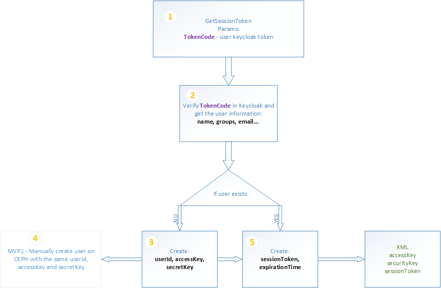
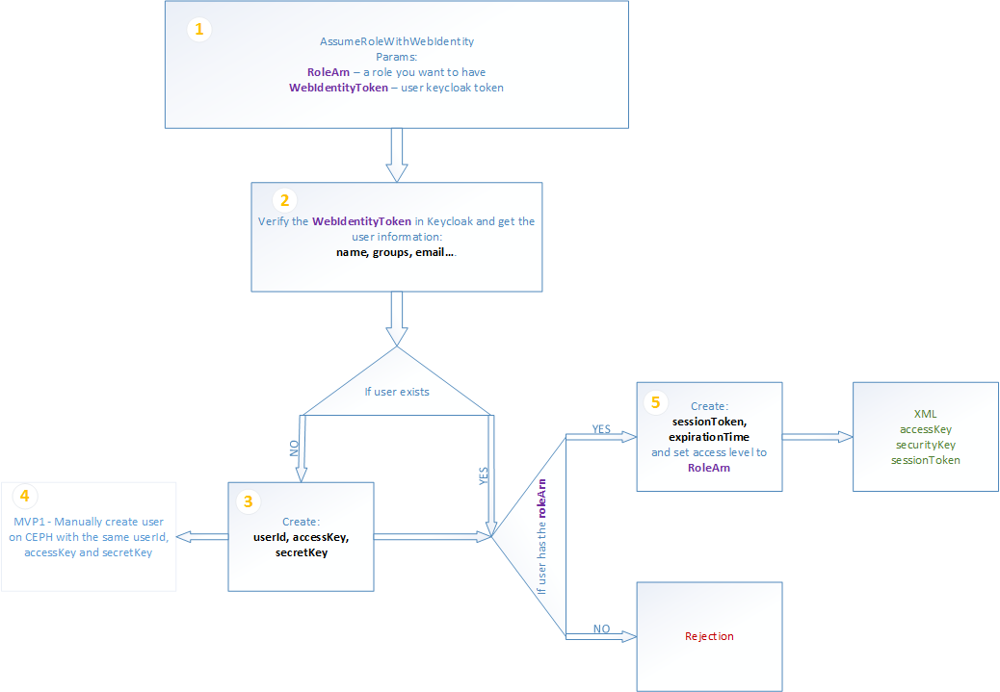

# MVP 1

Assumption - all users and groups are in keycloak

## GetSessionToken

1. After authentication in Keycloak user provides the keycloak token to **TokenCode** parameter.
2. STS verifies the token (decode the json web token _JWT_) and get information about the user.
3. If the user does not exist in STS the user is created:
    - userId = user login name
    - accessKey is generated
    - secureKey is generated
4. If the user has been just created in STS the user need to be add on CEPH with the same userId, accessKey and secretKey (now it will be done manuall and later automatically)
5. STS generates sessionToken and set expirationTime. The sessionToken is set on the userId level - it means s3 proxy will authorize the access on user level.

## AssumeRoleWithWebIdentity

1. After authentication in Keycloak user provides the keycloak token to **WebIdentityToken** parameter.
2. STS verifies the token (decode the json web token _JWT_) and get information about the user.
3. If the user does not exist in STS the user is created:
    - userId = user login name
    - accessKey is generated
    - secureKey is generated
4. If the user has been just created in STS the user need to be add on CEPH with the same userId, accessKey and secretKey (now it will be done manuall and later automatically)
5. Only if the user has the role that was requested STS generates sessionToken and set expirationTime. The sessionToken is set on the **RoleArn** level - it means s3 proxy will authorize the access on role level you assumed.
